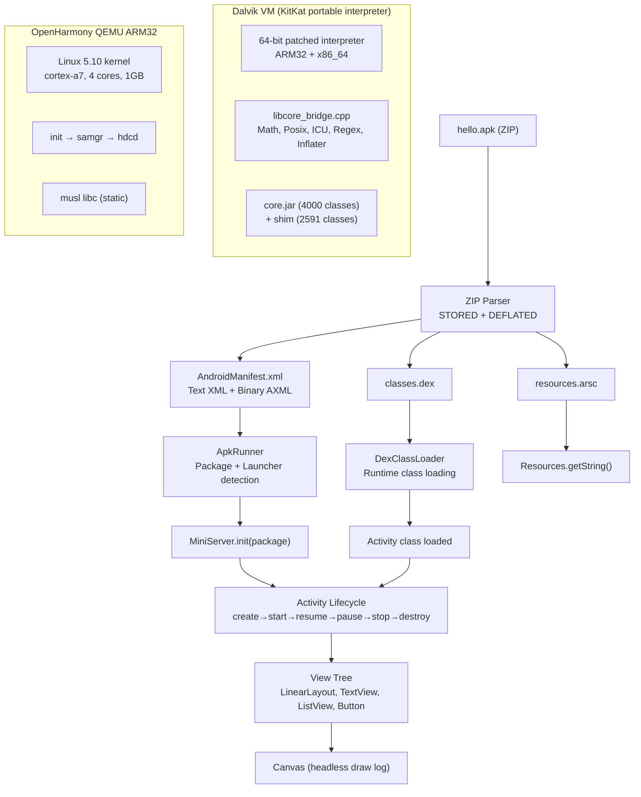
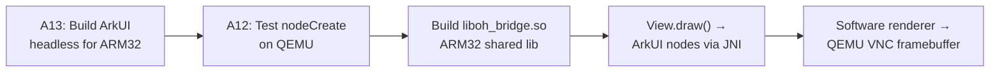

# Real Android APK on Dalvik/OHOS — Status

## Supervisor Update: 2026-04-30

The active real-APK proof has returned to the stock McDonald's APK. The
controlled `com.westlake.mcdprofile` app remains useful as a portable OHOS
boundary test, but it is no longer the current contract frontier.

Current verified stock McDonald's status:

Newest source-built real-McD runtime/symbol-gate frontier, 2026-04-30
01:15:

- deployed artifacts were
  `dalvikvm=1c136763c746f8e16e06451779b6e201621eeb0ca10ccd59a6d01a53f19fd9a3`,
  `aosp-shim.dex=2baa2ab7149285f283e2537d7c2dd939f1c30cb2ecd949e6fef34b5a6ecbb6cd`,
  and
  `westlake-host.apk=d9e505b30962bf7b837a544aa8d5826a2af37ec0ef1431d976b2f5d0fc13a213`;
- proof artifacts:
  `artifacts/real-mcd/20260430_011506_clean_patchsystem_a15_arm64/logcat_tail.log`
  and
  `artifacts/real-mcd/20260430_011506_clean_patchsystem_a15_arm64/screen.png`;
- screenshot is a valid full-phone `1080x2280` PNG. Local and phone hashes
  match for the deployed runtime, `aosp-shim.dex`, and boot classpath jars;
- this is the first accepted real-McD proof from the durable
  `/home/dspfac/art-latest` patch build path after the VarHandle fix. Clean
  bionic rebuild reports `runtime 230 / 230`, including the real A15
  `runtime/arch/arm64/thread_arm64.cc` and
  `runtime/arch/arm64/entrypoints_init_arm64.cc`;
- the bionic and OHOS ARM64 Makefiles now assemble A15
  `quick_entrypoints_arm64.S` with A15 include precedence, keep A11 JNI
  entrypoints only for the known portable-toolchain CFI gap, and build
  `thread_cpu_stub.cc` as its own support object instead of accidentally
  compiling `metrics_stubs.cc` under multiple object names;
- `scripts/check-westlake-runtime-symbols.sh` passes on the deployed runtime.
  The previous strong unresolved symbols are gone, including
  `InitEntryPoints`, `UpdateReadBarrierEntrypoints`, `Thread::InitCpu`,
  `Thread::CleanupCpu`, `WebPDecodeRGBA`,
  `SendFileDescriptorVector`, `__android_log_error_write`, and the A11
  instrumentation quick-entrypoint dependencies. `nm -u` now shows only weak
  loader/HWASAN hooks;
- accepted focused proof grep contains only
  `Strict dashboard frame reason=dashboard-renderLoop`; it has no
  `pending UOE`, `ThreadGroup.uncaughtException`, VarHandle diagnostic marker,
  `DoCall-TRACE`, `NoClassDefFoundError`, `UnsatisfiedLinkError`, JNI fatal,
  or fatal signal marker;
- this is not production McDonald's UI compatibility. The broader log still
  contains known `PFCUT` fallback/diagnostic paths for ICU/timezone/currency,
  atomics/Unsafe, proxy dispatch, and McD logging/perf cutouts. Those remain
  explicit workstream debt.

Previous phone-proven real-McD Java concurrency frontier, 2026-04-30 00:38:

- deployed artifacts were
  `dalvikvm=77389791ad497b68efe7357c96f7c2ec84522fb6daff3ba82b56e584714984db`,
  `aosp-shim.dex=2baa2ab7149285f283e2537d7c2dd939f1c30cb2ecd949e6fef34b5a6ecbb6cd`,
  and
  `westlake-host.apk=d9e505b30962bf7b837a544aa8d5826a2af37ec0ef1431d976b2f5d0fc13a213`;
- proof artifacts:
  `artifacts/real-mcd/20260430_003805_clean_varhandle_futuretask/logcat_tail.log`
  and
  `artifacts/real-mcd/20260430_003805_clean_varhandle_futuretask/screen.png`;
- the previous background `FutureTask`/Rx scheduler
  `UnsupportedOperationException` is closed. Diagnosis showed a
  `java.lang.invoke.FieldVarHandle` for `FutureTask.runner` with
  `accessModesBitMask=0x0`, causing `compareAndSet` to be rejected before the
  existing native field CAS implementation ran;
- the runtime now permits zero-mask `FieldVarHandle`/`StaticFieldVarHandle`
  access only when the native `ArtField` and variable type support the access
  mode, while preserving read-only handling for final fields. This advances
  generic Java concurrency compatibility for `FutureTask`,
  `ScheduledThreadPoolExecutor`, and `ConcurrentLinkedQueue`;
- accepted clean proof grep contains only
  `Strict dashboard frame reason=dashboard-renderLoop`; it has no
  `pending UOE`, `ThreadGroup.uncaughtException`, VarHandle diagnostic marker,
  `DoCall-TRACE`, or `NoClassDefFoundError`.

Previous phone-proven real-McD dashboard/render-loop frontier, 2026-04-30
00:16:

- deployed artifacts were
  `dalvikvm=fbce9ed66b5e023f749c6f83cf8df2b48abe97c5e91fdf2acc96675db8ba5f05`,
  `aosp-shim.dex=2baa2ab7149285f283e2537d7c2dd939f1c30cb2ecd949e6fef34b5a6ecbb6cd`,
  and
  `westlake-host.apk=d9e505b30962bf7b837a544aa8d5826a2af37ec0ef1431d976b2f5d0fc13a213`;
- proof artifacts:
  `artifacts/real-mcd/20260430_001605_clean_ncdfe_logging/logcat_tail.log`
  and
  `artifacts/real-mcd/20260430_001605_clean_ncdfe_logging/screen.png`;
- the previous render-loop `NoClassDefFoundError` is closed. Runtime
  descriptor tracing identified the failing descriptor as
  `Ljava/lang/management/ManagementFactory;`, which was caused by Westlake shim
  code in `android.os.Process` and `android.os.SystemClock`, not by the stock
  APK. Those shims now use `/proc/self/stat`, `System.nanoTime()`, and portable
  fallbacks instead of the non-Android `java.lang.management` package;
- temporary boot-miss descriptor logging was disabled again after diagnosis, so
  the accepted runtime is the clean `fbce9ed6...` build rather than the noisy
  diagnostic runtime;
- the proof shows the dashboard render loop pumping messages, consuming a touch
  marker, and emitting `Strict dashboard frame reason=dashboard-renderLoop`
  without the earlier render-loop boot-class-loader miss;
- this is a stronger portable-substrate proof because it removes a
  non-Android Java SE dependency from the shim. It is not a production
  McDonald's UI compatibility claim.

Newest phone-proven native/service frontier, 2026-04-29 23:50 through
2026-04-30 00:02:

- `artifacts/real-mcd/20260429_235043_realm_native_boundary/` proves a
  temporary Realm boundary probe: `Runtime.nativeLoad` returns success for
  `librealm-jni`, and Realm native methods are no-op defaulted at the
  interpreter boundary. This moves the app past the `libdl.a is a stub` crash,
  but it does not implement Realm persistence and must not be treated as stock
  native-library compatibility;
- `artifacts/real-mcd/20260429_235317_analytics_class_load/` removes the
  over-broad McD analytics `Class.forName` fallback. The real
  `McDTagManagerWrapper` can load again, and the earlier
  `IMcDAnalytics.trackDataWithKey` null-render-loop failure disappears;
- `artifacts/real-mcd/20260429_235855_java_telephony/` closes the
  `OHBridge.telephonyGetNetworkOperatorName` stale native SIGBUS by moving
  common `TelephonyManager` answers to Java-level portable defaults;
- `artifacts/real-mcd/20260430_000242_location_java_surface/` closes the same
  guest-deferred OHBridge problem for `LocationManager` by returning a bounded
  default last-known location and enabled-provider state from Java;
- this proves a new southbound rule for the OHOS port: framework service APIs
  used by the guest must either be Java/direct portable shims or registered
  through an explicitly validated host-service bridge. They cannot rely on
  unregistered `OHBridge` natives in strict subprocess mode, where OHBridge
  logs `guest defer registration`.

Current hard blockers after the newest proofs:

- PF-494 remains open. Real stock APK native-library loading is not solved;
  the Realm support currently in the accepted proof is a boundary probe with
  zero/default native results;
- Realm schema/query/storage calls still surface as pending UOE/default-return
  behavior in some windows. Closing this requires either a real OHOS-portable
  native loading contract or a deliberate Java Realm/storage compatibility
  layer, not silent success from `Runtime.nativeLoad`;
- `McDMarketApplication.onCreate` and backend/config bootstrap remain open.
  The latest 01:15 focused proof window does not show the earlier
  `Config failed to download` marker, but no successful production config/data
  path has been proven;
- visible dashboard content remains Westlake fallback scaffolding rather than
  the real McDonald's production fragment/data/UI.
- accepted evidence still contains platform cutout diagnostics (`PFCUT`) for
  ICU/timezone/currency, Unsafe/atomic helpers, proxy repair, and McD
  logging/perf no-ops. These must either become generic portable
  implementations or be removed as diagnostics before a production runtime
  claim.

Newest phone-proven native/split metadata frontier, 2026-04-29 23:37:

- deployed artifacts were
  `dalvikvm=1011e6072a0a289deda47a379e028382e224adf7d4c6fb5f2f2af5d3daa8c467`,
  `aosp-shim.dex=9d29d310c5d1928f27a2940c75f1a9ae824cc99582969ee6e2c281944c2c527e`,
  and
  `westlake-host.apk=3ceef0010d6533a9cdaf2842dab58f311ad2fbe99305ab8afb074e0d0bfe2f19`;
- proof artifacts:
  `artifacts/real-mcd/20260429_233724_split_metadata/logcat_tail.log`
  and
  `artifacts/real-mcd/20260429_233724_split_metadata/screen.png`;
- the portable guest `ApplicationInfo` now exposes staged
  `splitSourceDirs` from `westlake.apk.splitSourceDirs`, and the host passes
  the copied split APK paths into the Westlake subprocess;
- this closes the ReLinker metadata failure where Realm previously reported
  `Could not find 'librealm-jni.so' ... only found: []`;
- ReLinker now finds the split ABI payload and attempts the versioned copied
  library: `Runtime_nativeLoad
  path=/data/local/tmp/westlake/app_lib/librealm-jni.so.10.19.0`;
- the new top native blocker is dynamic-loader compatibility:
  `UnsatisfiedLinkError: libdl.a is a stub --- use libdl.so instead`;
- the real APK still reaches `Dashboard active` and strict dashboard frames
  after this new frontier is exposed.

Current hard blockers after this proof:

- Westlake's static `dalvikvm` native-load path cannot yet load real APK
  shared libraries that depend on Android dynamic linker libraries such as
  `libdl.so`; Realm JNI exposes this first;
- diagnostic `dalvikvm-dynamic=32c027a0643ad4e8b303ea8c876cfac2ab6dc4c631cb8b741e3ef98e33c9225f`
  was built and tested at
  `artifacts/real-mcd/20260429_234224_dynamic_native_loader/`, but it is
  rejected because it aborts before app code with a `java.lang.String` class
  mismatch and `SIGABRT`;
- Realm remains uninitialized after the native-load failure, so app code still
  logs `Call Realm.init(Context) before creating a RealmConfiguration`;
- `McDMarketApplication.onCreate` still logs `Config failed to download`;
- visible dashboard content remains Westlake fallback scaffolding rather than
  real McDonald's production fragment/content.

Newest phone-proven dashboard/runtime/render frontier, 2026-04-29 23:29:

- phone launch uses `com.westlake.host/.WestlakeActivity` with
  `launch=WESTLAKE_ART_MCD`;
- guest APK is the stock McDonald's APK at
  `/data/local/tmp/westlake/com_mcdonalds_app.apk`;
- deployed guest runtime artifacts were
  `dalvikvm=1011e6072a0a289deda47a379e028382e224adf7d4c6fb5f2f2af5d3daa8c467`,
  `aosp-shim.dex=d82381f6e44c5d0d1ba2169df63ab790b026064296b849013d18be3e66574744`,
  and
  `westlake-host.apk=421d8e71a533360a59e6213275188342f883afccd56cb277885b083b33fe3e6b`;
- proof artifacts:
  `artifacts/real-mcd/20260429_232926_viewmodel_helper/logcat_tail.log`
  and
  `artifacts/real-mcd/20260429_232926_viewmodel_helper/screen.png`;
- this proof closes the latest standalone runtime crash series:
  `FileSystems.getDefault()` no longer returns null for `File.toPath()`,
  `CharsetEncoder`/`CharsetDecoder` no longer fail on null
  `CodingErrorAction.REPORT`, `UnixNativeDispatcher.stat(UnixPath, ...)`
  no longer enters the bad `NativeBuffer`/`stat0` SIGBUS path, and
  `androidx.lifecycle.viewmodel.ViewModelProviderImpl_androidKt.a(factory,
  KClass, extras)` now delegates through the `Class` factory overload instead
  of crashing in stale quick code;
- the real APK again reaches real `SplashActivity`, launches real
  `com.mcdonalds.homedashboard.activity.HomeDashboardActivity`, logs
  `Dashboard active`, and emits strict Westlake dashboard frames:
  `dashboard-first root=android.widget.LinearLayout bytes=776 views=29
  texts=14 buttons=6 images=1`, followed by `dashboard-renderLoop`;
- no `SIGBUS`, no `SIGSEGV`, no `SIGABRT`, and no `Fatal signal` marker
  appear in the accepted McDonald's proof window.

Acceptance boundary: this is a stronger real stock-APK
Splash/HomeDashboard runtime proof because the APK now crosses more of its own
NIO, charset, AndroidX Lifecycle, Hilt, Gson, and Realm bootstrap code before
falling back to Westlake-rendered dashboard scaffolding. It is still not stock
McDonald's production UI compatibility.

Current hard blockers after this proof:

- `McDMarketApplication.onCreate` still fails early with
  `RuntimeException: Config failed to download`; Activity launch survives it,
  but production app initialization is not clean;
- Realm native integration is not complete. The proof attempts
  `Runtime_nativeLoad path=/data/local/tmp/westlake/app_lib/librealm-jni.so`,
  but `PersistenceManager` later tolerates
  `MissingLibraryException: Could not find 'librealm-jni.so'` and app code logs
  `Call Realm.init(Context) before creating a RealmConfiguration`;
- AndroidX ViewModel creation now survives the KClass helper, but one default
  factory path still falls through to an unsupported `Factory.create(String,
  CreationExtras)` branch and Westlake allocates a model without constructor as
  a boundary probe. That must become a generic AndroidX-compatible factory
  path, not a production shortcut;
- visible dashboard content is still Westlake-generated fallback scaffolding,
  not real McDonald's backend/menu state or real `HomeDashboardFragment`
  content.

Previous phone-proven dashboard/runtime/render frontier, 2026-04-29 22:08:

- phone launch uses `com.westlake.host/.WestlakeActivity` with
  `launch=WESTLAKE_ART_MCD`;
- guest APK is the stock McDonald's APK at
  `/data/local/tmp/westlake/com_mcdonalds_app.apk`;
- deployed guest runtime artifacts were
  `dalvikvm=d9e5d37256fd52284234fd8621129f19985c7c12b754023f74b97b4c69f44a3b`,
  `aosp-shim.dex=40766a520d19e2a403383d971bf4717793115b8a459c5bd7bcb0db03ad844a65`,
  and
  `westlake-host.apk=d1f07ca75d025b2650f449c626b29268c054b1aade391bc412f1cfd6da1c8f0d`;
- proof artifacts:
  `artifacts/real-mcd/20260429_220819_split_native/logcat_tail.log`
  and
  `artifacts/real-mcd/20260429_220819_split_native/screen.png`;
- screenshot is a valid `1080x2280` phone capture and visibly shows a
  full-height McDonald's dashboard frame rendered by Westlake through the
  host `DisplayListFrameView` path;
- the real APK reaches real `SplashActivity`, launches real
  `com.mcdonalds.homedashboard.activity.HomeDashboardActivity`, and
  `HomeDashboardActivity.onCreate` completes;
- `MethodHandles.lookup()` now reports the real caller class for core
  concurrency class initialization. The proof logs valid callers for
  `FutureTask`, `ConcurrentLinkedQueue`, `AtomicBoolean`, and `ForkJoinPool`;
  the previous `illegal lookupClass: class java.lang.invoke.MethodHandles`
  blocker is absent;
- `DexPathList.findLibrary()` no longer crashes on a null native-library path
  array. Westlake now copies installed sibling split APKs, extracts
  `lib/arm64-v8a/*.so` into `/data/local/tmp/westlake/app_lib`, and the proof
  resolves Realm through the real split payload:
  `DexPathList.findLibrary realm-jni ->
  /data/local/tmp/westlake/app_lib/librealm-jni.so`, followed by
  `Runtime_nativeLoad path=/data/local/tmp/westlake/app_lib/librealm-jni.so`;
- host logs show `Strict dashboard frame reason=dashboard-first
  root=android.widget.LinearLayout bytes=776 views=29 texts=14 buttons=6
  images=1`, followed by a `dashboard-renderLoop` frame;
- no `SIGBUS`, no `Fatal signal`, no `VMRuntime.getSdkVersion`
  `NoSuchMethodError`, and no `illegal lookupClass` appear in the accepted
  proof window.

Acceptance boundary: this is now a real stock-APK
Splash/HomeDashboard lifecycle proof plus visible Westlake-rendered dashboard
presentation. It is still not stock McDonald's production UI compatibility.
The visible menu is generated fallback content installed into the real
McDonald's dashboard container. The next contract frontier is replacing that
fallback with real APK-driven data/layout/rendering while keeping the same
portable Westlake guest path.

Current hard blockers after this proof:

- `McDMarketApplication.onCreate` still logs `NullPointerException`; Activity
  launch survives it, but production app initialization is not clean;
- Realm native library lookup reaches and native-loads the real split
  `librealm-jni.so`, but `PersistenceManager` class initialization still
  tolerates a later `NullPointerException: charset`; libcore
  charset/provider/default-encoding coverage is now the next hard bootstrap
  gap after real native library load;
- visible dashboard content is Westlake-generated fallback scaffolding, not
  real McDonald's backend/menu state or real `HomeDashboardFragment` content;
- generic Material/AppCompat rendering, generic hit testing, scrolling, and
  fragment attach/transaction still need to replace McD-specific fallback
  scaffolding before stock UI compatibility can be claimed.

Previous phone-proven dashboard/runtime/render frontier, 2026-04-29 22:03:

- `dalvikvm=d9e5d37256fd52284234fd8621129f19985c7c12b754023f74b97b4c69f44a3b`,
  `aosp-shim.dex=40766a520d19e2a403383d971bf4717793115b8a459c5bd7bcb0db03ad844a65`,
  and
  `westlake-host.apk=0945cd73041a8522e411c934f5d9d63ab81d714fda25999018fb39f43a2b0cc1`;
- proof artifacts:
  `artifacts/real-mcd/20260429_220309_native_lib/logcat_tail.log`
  and
  `artifacts/real-mcd/20260429_220309_native_lib/screen.png`;
- this proof closed the generic null-array crash in `DexPathList.findLibrary`
  and exposed the missing split/native payload as the next boundary:
  `DexPathList.findLibrary realm-jni -> <missing>`.

Previous phone-proven dashboard/runtime/render frontier, 2026-04-29 18:52:

- `dalvikvm=0b7acbe35837c357ded4e3413f3c64057efd256b9e31854221112b346f14b17f`,
  `core-oj.jar=e19236b056ec6257c751d070f758e682dc1c62ba0cb042fde93d3eec09d647c2`,
  and
  `aosp-shim.dex=2284d0f553ffb9eae3e1f7cc4d1afccf3fcb0875876ddedae3bec3cc9d76d1e1`;
- proof artifacts:
  `artifacts/real-mcd/20260429_185146/logcat_tail_20260429_185146.log`
  and
  `artifacts/real-mcd/20260429_185146/real_mcd_screen_20260429_185146.png`;
- this proof closed the former `OHBridge.isNetworkAvailable()` native SIGBUS
  for the current path by routing `ConnectivityManager` availability/type
  checks through the portable Java `NetworkBridge`.

Previous phone-proven dashboard/render/input frontier, 2026-04-29 15:50:

- phone launch uses `com.westlake.host/.WestlakeActivity` with
  `launch=WESTLAKE_ART_MCD`;
- guest APK is the stock McDonald's APK at
  `/data/local/tmp/westlake/com_mcdonalds_app.apk`;
- deployed guest runtime artifacts were
  `dalvikvm=a1d54866a5b1e70ede0a0919ccaeca63b0a3deeae4972ab23d54e31412089bd8`,
  `core-oj.jar=e19236b056ec6257c751d070f758e682dc1c62ba0cb042fde93d3eec09d647c2`,
  and
  `aosp-shim.dex=f62561aa3dbec74269b98d9aa46ba1925dc204148d6ee9d875d77d818d243282`;
- host APK was
  `63dda5e62c61387004df15e7fb0f4a2ff43bbd3f3e3b7536c53eacbc495094bb`;
- proof artifacts:
  `artifacts/real-mcd/20260429_155050/real_mcd_touch_routed_20260429_155050.log`
  and
  `artifacts/real-mcd/20260429_155050/real_mcd_touch_routed_20260429_155050.png`;
- screenshot is a valid `1080x2280` phone capture and visibly shows the
  McDonald's dashboard fallback with state text
  `2 items in bag | Added Big Mac Combo`;
- the real APK reaches `SplashActivity`, launches real
  `com.mcdonalds.homedashboard.activity.HomeDashboardActivity`, wires APK
  resources, enters dashboard `onCreate`, and installs a Westlake-rendered
  widget fallback after dashboard `onCreate` hits the current core runtime
  gap;
- host logs show `Strict dashboard frame reason=dashboard-first bytes=1736
  views=48 texts=30 buttons=8 images=3` and later touch-driven frames;
- ADB touch is proven through the Westlake input path:
  phone tap -> host touch file -> Westlake subprocess -> dashboard route ->
  `TextView` state mutation -> new DLST frame on the phone;
- this is not real McDonald's production dashboard UI yet. It is a real-APK
  lifecycle/resource/render/input proof using a McD-specific dashboard
  fallback scaffold. Generic hit testing is still incomplete, so the current
  fallback uses direct coordinate routing for the dashboard button zones.

Hard blockers after that previous proof, partly superseded by the 18:52 proof:

- `HomeDashboardActivity.onCreate` still throws
  `NoSuchMethodError: dalvik.system.VMRuntime.getSdkVersion()I` from
  `/data/local/tmp/westlake/core-libart.jar`; this is not present in the
  18:52 proof window;
- real `HomeDashboardFragment` lifecycle attach and generic Material rendering
  remain strict-mode skipped because the reflective/app FragmentManager path
  can still hit runtime dispatch faults;
- the visible UI is still Westlake fallback content, not inflated real
  McDonald's dashboard content;
- generic View hit testing/layout must replace the dashboard-specific direct
  router before this can count as stock UI compatibility.

Newest phone-proven frontier, 2026-04-29 14:25:

- phone launch still uses `com.westlake.host/.WestlakeActivity` with
  `launch=WESTLAKE_ART_MCD`;
- deployed guest runtime artifacts were
  `dalvikvm=d7bb5761ea16d56ff41ce49a6499627748054d3af8413bb44e1615ec9dd2f8d2`,
  `core-oj.jar=8c344b1ac41bdbb4403763a5b061a8313056a010752835273cf90d79dd561d44`,
  and
  `aosp-shim.dex=9d7ffa3a60c37b21fc1bed01f1cb9f52de8e720b4c454d9d096eb255ef5c5bf4`;
- log:
  `/mnt/c/Users/dspfa/TempWestlake/real_mcd/real_mcd_20260429_142531.log`;
- screenshot:
  `/mnt/c/Users/dspfa/TempWestlake/real_mcd/real_mcd_20260429_142531.png`
  (`1080x2280`, mostly blank/black frame);
- the run clears the previous Realm `UnixFileSystem.list(File)` SIGBUS,
  `AtomicInteger.getAndIncrement`, `AtomicReference.getAndSet`,
  `Unsafe.getUnsafe`, and `AtomicLong.compareAndSet` blockers;
- the guest reaches SplashActivity construction, AndroidX ActivityResult
  request-code generation, Hilt listener registration, and NewRelic trace
  construction;
- the current hard gaps are generic standalone runtime gaps, not a visible UI
  milestone: `System.getProperty(...)` can still hit null `System.props`, and
  the NewRelic no-op cutout returns null for `Util.getRandom()`, causing
  `Trace.<init>() -> Random.nextLong()` on a null receiver.

Local pending fix, not yet phone-proven:

- `core-oj.jar=4b152c62e7746ca93df19c6e25fe744c86fe29b1dbff45d9fc24a9675d855c45`
  adds guarded `System.getProperty(String)` and
  `System.getProperty(String,String)` null-protection. The phone rerun is
  blocked by WSL/Windows ADB interop returning
  `UtilAcceptVsock: accept4 failed 110`.
- runtime candidate
  `/home/dspfac/art-latest/build-bionic-arm64/bin/dalvikvm`
  (`b193e5f3ff3ba564f58319fe3b81cca3ead7c605450e7c05e68e06d14d7151cd`,
  symbol gate passed) excludes `NewRelic Util.getRandom()` from the blanket
  NewRelic no-op path. It is not accepted until it passes the real-McD phone
  proof with the pending `core-oj.jar`.

Previous dashboard-probe status:

- launch path is `com.westlake.host/.WestlakeActivity` with
  `launch=WESTLAKE_ART_MCD`;
- host APK owns the Android phone Activity/Surface/input on phone ART;
- the guest APK runs in a separate Westlake `dalvikvm` subprocess;
- `McDMarketApplication.onCreate` runs;
- `SplashActivity.onCreate` runs;
- `HomeDashboardActivity` is scheduled and entered;
- `HomeDashboardFragment` is instantiated, `performCreate()` and
  `performCreateView()` run, a `ScrollView` is attached, and
  `performActivityCreated()` runs;
- the visible frame is still mostly blank Westlake output, not the real
  dashboard.

Previous dashboard-probe blocker:

- the latest `d7bb5761...` runtime plus `a9b115...` shim phone proof no longer
  reports `DATABINDING_TAG_NULL`, `ApplicationNotificationBinding`, or a fatal
  signal in the captured log;
- the Material `BottomNavigationView` self-cast `ClassCastException` is moved
  past by a boot-owned Material runtime policy proof;
- the former FragmentManager `commitNow()` SIGBUS and
  `HomeDashboardFragment.performAttach()` SIGBUS are bypassed in strict mode
  for this proof, exposing the next boundary;
- `HomeDashboardActivity.onCreate` still throws
  `NullPointerException` on `RestaurantModuleInteractor.s()`. This is now an
  app dependency/Hilt state gap, not the former Material duplicate-class
  boundary.

Previous dashboard-probe phone proof:

- log:
  `/mnt/c/Users/dspfa/TempWestlake/real_mcd/real_mcd_material_policy_20260429_130813.log`
  (`57eb43e76d70f277dad79527e496a27699fba537a6a7f25753e108d8ba90ebbf`)
- screenshot:
  `/mnt/c/Users/dspfa/TempWestlake/real_mcd/real_mcd_material_policy_20260429_130813.png`
  (`a4ae352c727c2c8f182275b68beb48543c258ffa4eb6652ed006ea7d103d3bd3`,
  valid `1080x2280` PNG)
- deployed runtime:
  `d7bb5761ea16d56ff41ce49a6499627748054d3af8413bb44e1615ec9dd2f8d2`
- deployed shim:
  `a9b115a81dba519991d20aa3e48e52f701abec43b71dd652cf07c933856bf40e`
- deployed host APK:
  `f080e20e9e96a6965be74a7ed38ea4369de38200b71054ffdeca6949b5b5d3a3`

Important runtime note:

- local ART runtime candidate
  `7523774ecfdabeec733718326a3f74e87ce51aa080b28237a741f253be0efadb`
  is rejected. It regressed before Splash/Dashboard with an
  `AtomicIntegerFieldUpdater` bootstrap NPE and is not the accepted phone
  runtime.
- `d7bb5761...` is accepted as a phone-proven one-byte derivative of baseline
  runtime `c90d15a...`; clean source rebuild/reproducibility remains open.

Next work is to phone-prove the pending `System.getProperty` core patch, fix
the NewRelic `Util.getRandom()` cutout, continue replacing tactical
`core-oj.jar` byte patches with source-level libcore/runtime fixes, then return
to the `RestaurantModuleInteractor.s()` state gap, Material ownership
reproducibility, and generic app-AndroidX fragment attach/transaction path.
Mock McD/Yelp visuals are not accepted as replacement evidence for this
frontier.

## Supervisor Update: 2026-04-28

The active bridge between controlled apps and a real McDonald's-class APK is
now PF-466, the controlled mock app `com.westlake.mcdprofile`, documented in
`docs/engine/OHOS-MCD-PROFILE-INTEGRATION.md`. It is accepted on a real Android
phone through Westlake `dalvikvm` with compiled XML inflation, Material-shaped
tags present in the APK, host/OHBridge JSON/image/REST, SharedPreferences,
guest `String.getBytes("UTF-8")`, full-phone `DLST` through repeated-cart and
post-checkout navigation frames, and strict touch-file interaction markers.
The latest accepted phone run also launches the McD-profile Activity through
`WestlakeActivityThread` and
`AppComponentFactory`, wires the McD-profile XML resource bytes before
`onCreate`, inflates a 25-view guest tree with 10 Material-shaped views, binds
the XML `ListView`, drives its adapter through position `4`, and accepts cart
count `2`, checkout, and Deals/Menu navigation markers with `checkedOut=true`
frame proof.
The latest PF-475 sidecar additionally proves touch-file packets can be
dispatched as `MotionEvent`s into that inflated XML tree and can trigger
generic checkout `MaterialButton` click plus XML `ListView`
`AdapterView.performItemClick()` markers from a real laid-out coordinate with
`fallback=false`. It does not yet replace the McD-profile direct
renderer/router, and ListView item selection is still launcher-assisted rather
than pure `AbsListView` touch dispatch.

This is not the real McDonald's APK. It supersedes older MockDonalds-only
status as the current practical OHOS port target because it is a richer
controlled mock boundary test. It still does not mean arbitrary real APKs are
ready: generic real-APK Activity construction still has to be generalized
beyond this controlled app, and runtime object-array correctness, libcore
charset/provider/default-encoding coverage beyond the accepted UTF-8 payload
slice, upstream Material compatibility, generic View rendering/input,
arbitrary stock-APK `resources.arsc` tables, production networking, and OHOS
host adapter parity remain open.

## Latest Milestone: Compressed APK on OHOS ARM32 QEMU

A real Android APK (with compressed DEFLATED entries) loads and launches on Dalvik VM
running on OpenHarmony ARM32 QEMU:

```
=== APK Runner ===
Loading: /data/a2oh/hello.apk
Package: com.example.hello
Launcher: com.example.hello.HelloActivity
Activities: [com.example.hello.HelloActivity]
DexClassLoader: loaded /data/a2oh/hello.apk
Starting: com.example.hello.HelloActivity
Loaded class: com.example.hello.HelloActivity
performCreate: com.example.hello.HelloActivity
=== HelloActivity: XML layout inflated ===
```

MockDonalds (mock McDonald's ordering app) passes 14/14 tests on QEMU:

```
=== MockDonalds End-to-End Test ===
  [PASS] MiniServer initialized
  [PASS] MenuActivity launched (8 menu items, ListView populated)
  [PASS] ItemDetailActivity (Big Mock Burger, $5.99)
  [PASS] Add to Cart, CartActivity (1 item, total $5.99)
  [PASS] Checkout: order saved, cart cleared
  [PASS] Canvas renders: menu text, item names, buttons
Results: 14 passed, 0 failed — ALL TESTS PASSED
```

## Architecture



## Full Stack (proven end-to-end)

```
APK file (.apk)
  → ZIP parse (manual, supports STORED + DEFLATED via zlib)
  → AndroidManifest.xml (text XML + binary AXML parser)
  → resources.arsc (string pool parser)
  → DexClassLoader (runtime class loading from APK)
  → Activity class instantiation
  → Full lifecycle (onCreate → onStart → onResume)
  → View tree (LinearLayout, TextView, ListView, Button, ImageView)
  → Canvas headless rendering (draw log)
  → Running on: OHOS kernel (ARM32) → musl libc → Dalvik VM → Android shim
```

## What Works

| Feature | Host x86_64 | OHOS ARM32 QEMU | Notes |
|---------|:-----------:|:---------------:|-------|
| APK ZIP extraction | ✅ | ✅ | STORED + DEFLATED entries |
| AndroidManifest.xml | ✅ | ✅ | Text XML + binary AXML |
| DexClassLoader | ✅ | ✅ | Load classes from APK at runtime |
| resources.arsc | ✅ | ✅ | String pool registration |
| Activity lifecycle | ✅ | ✅ | Full create→start→resume→pause→stop→destroy→restart |
| Intent + extras | ✅ | ✅ | String, int, double, boolean, Parcelable |
| View tree | ✅ | ✅ | LinearLayout, FrameLayout, RelativeLayout, ListView, Button, TextView, ImageView |
| ListView + Adapter | ✅ | ✅ | BaseAdapter, notifyDataSetChanged, view recycling |
| SQLite | ✅ | ✅ | In-memory: create/insert/query/update/delete, transactions |
| SharedPreferences | ✅ | ✅ | In-memory HashMap-backed |
| Canvas rendering | ✅ | ✅ | Headless draw log (no display) |
| Math natives | ✅ | ✅ | 27 methods: floor, ceil, sqrt, sin, cos, etc. |
| Double.parseDouble | ✅ | ✅ | With exponent reconstruction |
| String.split (regex) | ✅ | ✅ | POSIX regex via Pattern + Matcher |
| File I/O | ✅ | ✅ | open/read/write/close/fstat/mkdir/chmod |
| Inflater/Deflater | ✅ | ✅ | zlib via JNI (fixed heap corruption bug) |
| MockDonalds 14/14 | ✅ | ✅ | Full ordering app flow |
| Real APK loading | ✅ | ✅ | Compressed APK → Activity launch |

## What Doesn't Work Yet

| Feature | Owner | Issue | Notes |
|---------|-------|-------|-------|
| getString() | Agent B | Shim gap | NoSuchMethodError in APK Activity |
| String.format | Agent B | LocaleData NPE | SimpleFormatter workaround exists |
| Visual rendering (VNC) | Agent A | #532 | Needs ArkUI on ARM32 + framebuffer pipeline |
| ArkUI on ARM32 QEMU | Agent A | #532 | dalvikvm-arkui binary broken, needs rebuild |
| Binary AXML in real APKs | Agent B | Shim | Parser exists, needs testing with real APKs |

## Road to VNC Visual Output (Agent A)



All VNC rendering work is **Agent A** (OHOS platform / native / ArkUI):

1. **ArkUI headless engine on ARM32** — Cross-compile without `--unresolved-symbols=ignore-all`
2. **OHBridge JNI** — Connect View.draw() → ArkUI node creation → layout
3. **Framebuffer renderer** — Software render ArkUI tree → QEMU VNC display

## Runtime Flags

```bash
# Required for current dalvikvm (missing some core natives)
-Xverify:none -Xdexopt:none

# Boot classpath must include shim classes
-Xbootclasspath:/data/a2oh/core.jar:/data/a2oh/apkrunner.dex

# Environment
ANDROID_DATA=/data/a2oh ANDROID_ROOT=/data/a2oh
```

## How to Test on QEMU

```bash
# 1. Build APK runner DEX
cd android-to-openharmony-migration
javac -d /tmp/build --release 8 \
  -sourcepath "test-apps/mock:shim/java:test-apps/hello-world/src" \
  test-apps/hello-world/src/com/example/apkloader/ApkRunner.java \
  $(find test-apps/mock shim/java -name "*.java" ! -path "*/OHBridge.java")

java -jar .../dx.jar --dex --min-sdk-version=26 --output=/tmp/apkrunner.dex /tmp/build

# 2. Inject into QEMU userdata.img via debugfs
debugfs -w -R "write /tmp/apkrunner.dex a2oh/apkrunner.dex" userdata.img
debugfs -w -R "write hello.apk a2oh/hello.apk" userdata.img

# 3. Boot QEMU and run
cd /data/a2oh && ANDROID_DATA=/data/a2oh ANDROID_ROOT=/data/a2oh \
  ./dalvikvm -Xverify:none -Xdexopt:none \
  -Xbootclasspath:/data/a2oh/core.jar:/data/a2oh/apkrunner.dex \
  -classpath /data/a2oh/apkrunner.dex \
  com.example.apkloader.ApkRunner /data/a2oh/hello.apk
```

## Issue Tracker

All issues: https://github.com/A2OH/harmony-android-guide/issues

| # | Issue | Status | Owner |
|---|-------|--------|-------|
| #533 | [A14] Inflater SIGILL crash | ✅ Fixed | Agent A |
| #532 | [A13] ArkUI headless on ARM32 | In Progress | Agent A |
| #510 | [A12] ArkUI vtable on QEMU | Todo | Agent A |
| #473 | [A4] E2E smoke test on QEMU | ✅ Done | Agent A |
| #516 | [B21] APK gap analysis tool | Todo | Agent B |
